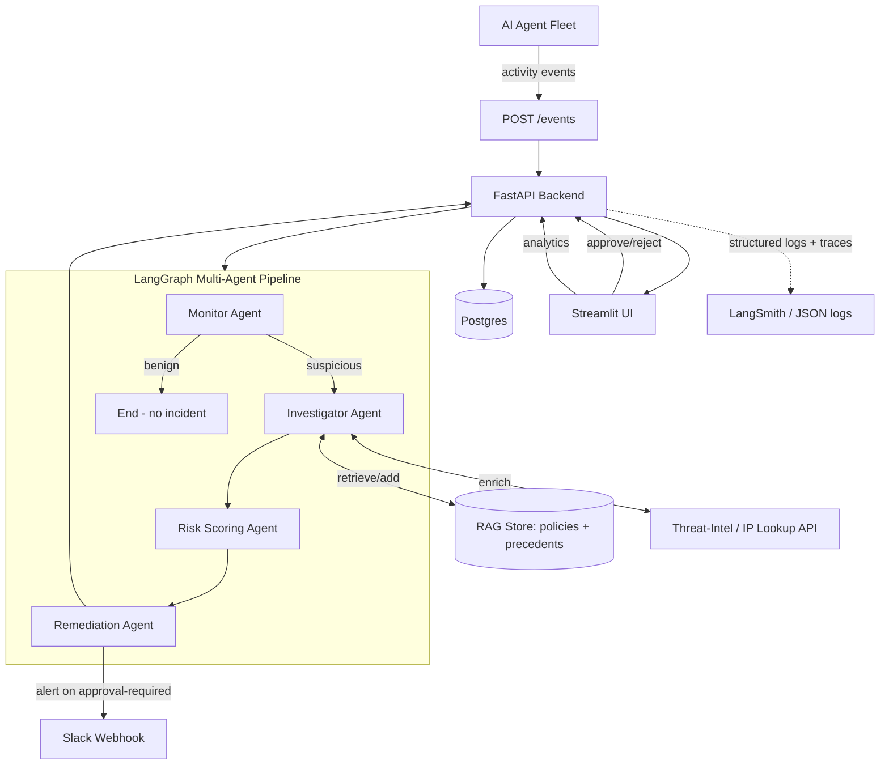

# SentinelX Architecture

## System diagram

## Data flow for one event

1. A client (an AI agent, an orchestrator, or a human via the UI simulator)
   `POST`s an event to `/events` with an `X-API-Key` header.
2. The backend persists the raw `AgentEvent` row, then invokes
   `run_pipeline(...)`, which runs the compiled LangGraph graph.
3. **Monitor** classifies the event as suspicious or not, using an LLM
   prompt (`app/agents/prompts.py::monitor_prompt`). If not suspicious, the
   graph terminates immediately — no `Incident` row is created.
4. **Investigator** (only runs for suspicious events):
   - Calls `lookup_ip_reputation()` (external tool #1) to enrich the event
     with network/geolocation context.
   - Calls `rag_store.retrieve()` to fetch the top-3 most relevant
     governance policies / historical precedents via TF-IDF cosine
     similarity.
   - Synthesizes investigation notes + key findings via an LLM call.
5. **Risk Scoring** assigns a 0–100 score and a `low/medium/high/critical`
   level based on the investigation notes and findings.
6. **Remediation** recommends one of five actions
   (`log_and_monitor`, `throttle_and_alert`, `revoke_credentials`,
   `quarantine_agent_and_revoke_credentials`, `dismiss_false_positive`) and
   decides whether human approval is required (always true for
   destructive/credential actions or high+ severity). If approval is
   required, it fires a Slack alert (external tool #2) immediately.
7. The backend persists an `Incident` + `RemediationAction` row. If no
   approval was required, the action is marked `executed` immediately and
   the incident is auto-resolved; the resolved summary is fed back into the
   RAG store as a new precedent, so future investigations benefit from it.
8. A human operator reviews pending incidents in the Streamlit UI (or via
   the API directly) and approves or rejects the recommended remediation.
   Both paths write an `AuditLog` row and send a Slack confirmation.

## Why these design choices

- **LangGraph over a plain chain**: the conditional short-circuit after
  Monitor (benign events never reach Investigate/Score/Remediate) is a
  first-class branching requirement, and LangGraph's `StateGraph` makes
  that explicit and independently testable per-node.
- **TF-IDF RAG instead of a vector DB**: keeps the project dependency-light
  and fast to build/run in a container while still demonstrating genuine
  retrieval-augmented grounding (policy citations feed directly into the
  investigation and risk-scoring prompts). Swapping in `pgvector` or
  Chroma later only requires changing `app/rag/store.py`.
- **Real OpenAI reasoning throughout**: every agent node calls the same
  `call_llm_json()` wrapper around `ChatOpenAI`, so there's one code path
  to reason about in production. Unit tests substitute a deterministic
  fake for that one function so the pipeline's control flow is still
  testable without an API key or network access.
- **Human-in-the-loop gate**: destructive remediation (revoking
  credentials, quarantining an agent) is never auto-executed above a
  configurable risk threshold — it is proposed, alerted via Slack, and
  requires an explicit, audited approval.
